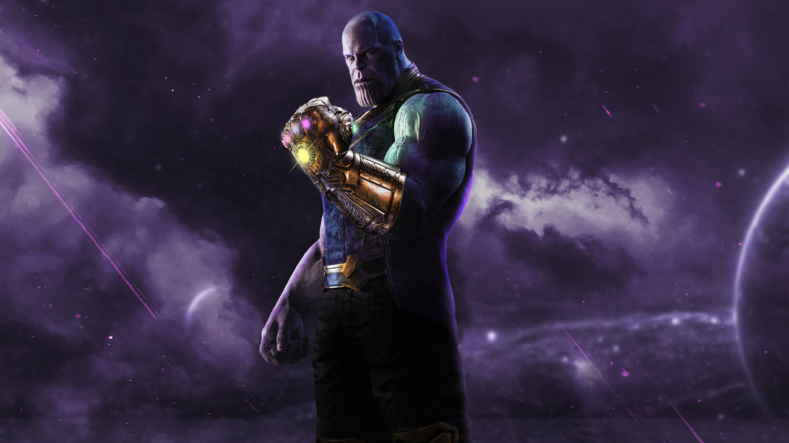

# 🏆 XXVII JUNIPLAC – Jogos Universitários

## 📌 Sobre o Projeto
Este é um template de **landing page simples e responsiva** criado em **HTML e CSS** para divulgação do evento **XXVII JUNIPLAC – Jogos Universitários**.  
A página apresenta informações sobre **datas, modalidades esportivas, local** e possui um **botão de inscrição** integrado ao Google Forms.

---

## ✨ Funcionalidades
- 📅 Exibe informações sobre o evento: data, local e chamada principal.  
- 🏀 Mostra modalidades esportivas: Futebol, Vôlei, Basquete e mais.  
- 🚀 Botão de inscrição com redirecionamento para o Google Forms.  
- 🎨 Estrutura visual simples e organizada em HTML + CSS.  

---

## 🛠 Tecnologias Utilizadas
- **HTML5** → Estrutura da página.  
- **CSS3** → Estilização e layout.  
- **Google Forms** → Sistema de inscrição integrado.  

---

## 📂 Estrutura de Pastas
